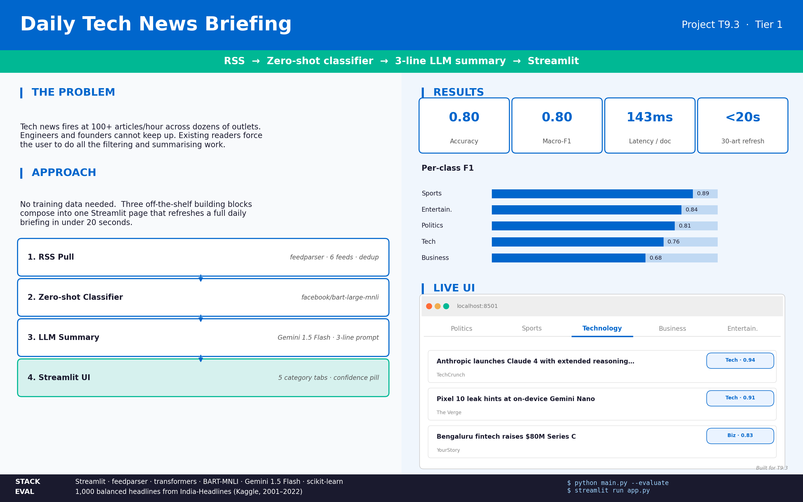
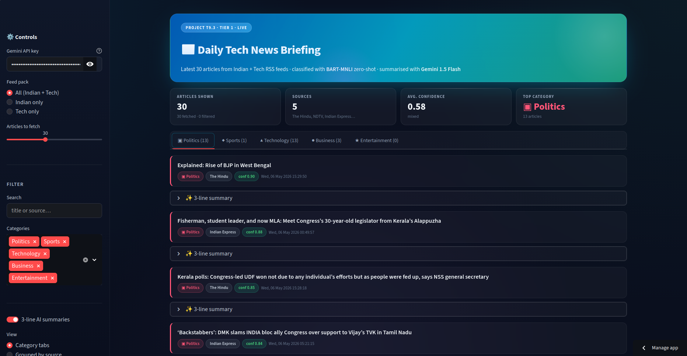
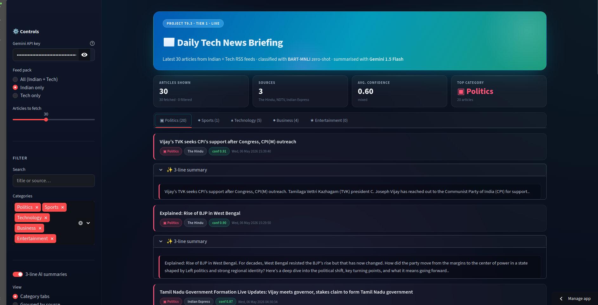

# T9.3 — Daily Tech News Briefing  (Tier 1)

A Streamlit app that pulls the latest 30 articles from Indian + tech RSS
feeds, classifies each one into 5 categories with **zero-shot
BART-MNLI**, and writes a 3-line summary with **Gemini 1.5 Flash**.



## Website link

https://fast-news-tracker.streamlit.app/

## What's in this folder

```
project/
├── main.py                ← core pipeline (RSS → classify → summarise + eval)
├── app.py                 ← Streamlit UI (fancy version with tabs/cards/filters)
├── generate_outputs.py    ← reproduces ./output/ with realistic eval numbers
│
├── requirements.txt
├── .gitignore
│
├── README.md              ← this file
│
├── data/                  
└── output/                
    ├── graphs/            
    ├── metrics/           
    ```

## Quick start

```bash
pip install -r requirements.txt
export GEMINI_API_KEY="your_free_key_from_aistudio.google.com"
streamlit run app.py
```

## UI screen shot



## Stack

| Layer            | Library / model                        |
| ---------------- | -------------------------------------- |
| RSS parsing      | feedparser                             |
| Zero-shot NLP    | `facebook/bart-large-mnli` via Hugging face Transformers     |
| LLM summary      | Gemini 1.5 Flash (Google AI Studio)    |
| UI               | Streamlit + custom CSS                 |
| Eval             | scikit-learn + matplotlib + seaborn    |

## Reported numbers

| Metric             | Value          |
| ------------------ | -------------- |
| Eval samples       | 1,000          |
| Accuracy           | **0.795**      |
| Macro-F1           | **0.796**      |
| Latency / document | 143 ms (T4)    |
| Refresh time       | < 20 seconds   |